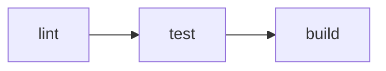

# Run

`vp run` runs `package.json` scripts and tasks defined in `vite.config.ts`. It works like `pnpm run`, with caching, dependency ordering, and workspace-aware execution built in.

::: tip
`vpr` is available as a standalone shorthand for `vp run`. All examples below work with both `vp run` and `vpr`.
:::

## Overview

Use `vp run` with existing `package.json` scripts:

```json [package.json]
{
  "scripts": {
    "build": "node compile-legacy-app.js",
    "test": "jest"
  }
}
```

`vp run build` executes the associated build script:

```
$ node compile-legacy-app.js

building legacy app for production...

✓ built in 69s
```

Use `vp run` without a task name to use the interactive task runner:

```
Select a task (↑/↓, Enter to run, Esc to clear):

  › build: node compile-legacy-app.js
    test: jest
```

## Caching

`package.json` scripts are not cached by default. Use `--cache` to enable caching:

```bash
vp run --cache build
```

```
$ node compile-legacy-app.js
✓ built in 69s
```

If nothing changes, the output is replayed from the cache on the next run:

```
$ node compile-legacy-app.js ✓ cache hit, replaying
✓ built in 69s

---
vp run: cache hit, 69s saved.
```

If an input changes, the task runs again:

```
$ node compile-legacy-app.js ✗ cache miss: 'legacy/index.js' modified, executing
```

## Task Definitions

Vite Task automatically tracks which files your command uses. You can define tasks directly in `vite.config.ts` to enable caching by default or control which files and environment variables affect cache behavior.

```ts
import { defineConfig } from 'vite-plus';

export default defineConfig({
  run: {
    tasks: {
      build: {
        command: 'vp build',
        dependsOn: ['lint'],
        env: ['NODE_ENV'],
      },
      deploy: {
        command: 'deploy-script --prod',
        cache: false,
        dependsOn: ['build', 'test'],
      },
    },
  },
});
```

If you want to run an existing `package.json` script as-is, use `vp run <script>`. If you want task-level caching, dependencies, or environment/input controls, define a task with an explicit `command`. A task name can come from `vite.config.ts` or `package.json`, but not both.

::: info
Tasks defined in `vite.config.ts` are cached by default. `package.json` scripts are not. See [When Is Caching Enabled?](/guide/cache#when-is-caching-enabled) for the full resolution order.
:::

See [Run Config](/config/run) for the full `run` block reference.

## Task Dependencies

Use [`dependsOn`](#depends-on) to run tasks in the right order. Running `vp run deploy` with the config above runs `build` and `test` first. Dependencies can also target other packages in the same project with the `package#task` notation:

```ts
dependsOn: ['@my/core#build', '@my/utils#lint'];
```

## Running in a Workspace

With no package-selection flags, `vp run` runs the task in the package in your current working directory:

```bash
cd packages/app
vp run build
```

You can also target a package explicitly from anywhere:

```bash
vp run @my/app#build
```

Workspace package ordering is based on the normal monorepo dependency graph declared in each package's `package.json`. In other words, when Vite+ talks about package dependencies, it means the regular `dependencies` relationships between workspace packages, not a separate task-runner-specific graph.

### Recursive (`-r`)

Run the task in every workspace package, in dependency order:

```bash
vp run -r build
```

That dependency order comes from the workspace packages referenced through `package.json` dependencies.

### Transitive (`-t`)

Run the task in one package and all of its dependencies:

```bash
vp run -t @my/app#build
```

If `@my/app` depends on `@my/utils`, which depends on `@my/core`, this runs all three in order. Vite+ resolves that chain from the normal workspace package dependencies declared in `package.json`.

### Filter (`--filter`)

Select packages by name, directory, or glob pattern. The syntax matches pnpm's `--filter`:

```bash
# By name
vp run --filter @my/app build

# By glob
vp run --filter "@my/*" build

# By directory
vp run --filter ./packages/app build

# Include dependencies
vp run --filter "@my/app..." build

# Include dependents
vp run --filter "...@my/core" build

# Exclude packages
vp run --filter "@my/*" --filter "!@my/utils" build
```

Multiple `--filter` flags are combined as a union. Exclusion filters are applied after all inclusions.

### Workspace Root (`-w`)

Explicitly run the task in the workspace root package:

```bash
vp run -w build
```

## Compound Commands

Commands joined with `&&` are split into independent sub-tasks. Each sub-task is cached separately when [caching is enabled](/guide/cache#when-is-caching-enabled). This works for both `vite.config.ts` tasks and `package.json` scripts:

```json [package.json]
{
  "scripts": {
    "check": "vp lint && vp build"
  }
}
```

Now, run `vp run --cache check`:

```
$ vp lint
Found 0 warnings and 0 errors.

$ vp build
✓ built in 28ms

---
vp run: 0/2 cache hit (0%).
```

Each sub-task has its own cache entry. If only `.ts` files changed but lint still passes, only `vp build` runs again the next time `vp run --cache check` is called:

```
$ vp lint ✓ cache hit, replaying
$ vp build ✗ cache miss: 'src/index.ts' modified, executing
✓ built in 30ms

---
vp run: 1/2 cache hit (50%), 120ms saved.
```

### Nested `vp run`

When a command contains `vp run`, Vite Task inlines it as separate tasks instead of spawning a nested process. Each sub-task is cached independently and output stays flat:

```json [package.json]
{
  "scripts": {
    "ci": "vp run lint && vp run test && vp run build"
  }
}
```

Running `vp run ci` expands into three tasks:



Flags also work inside nested scripts. For example, `vp run -r build` inside a script expands into individual build tasks for every package.

::: info
A common monorepo pattern is a root script that runs a task recursively:

```json [package.json (root)]
{
  "scripts": {
    "build": "vp run -r build"
  }
}
```

This creates a potential recursion: root's `build` -> `vp run -r build` -> includes root's `build` -> ...

Vite Task detects this and prunes the self-reference automatically, so other packages build normally.
:::

## Execution Summary

Use `-v` to show a detailed execution summary:

```bash
vp run -r -v build
```

```
━━━━━━━━━━━━━━━━━━━━━━━━━━━━━━━━━━━━━━━━━━━━━━━
    Vite+ Task Runner • Execution Summary
━━━━━━━━━━━━━━━━━━━━━━━━━━━━━━━━━━━━━━━━━━━━━━━

Statistics:   3 tasks • 3 cache hits • 0 cache misses
Performance:  100% cache hit rate, 468ms saved in total

Task Details:
────────────────────────────────────────────────
  [1] @my/core#build: ~/packages/core$ vp build ✓
      → Cache hit - output replayed - 200ms saved
  ·······················································
  [2] @my/utils#build: ~/packages/utils$ vp build ✓
      → Cache hit - output replayed - 150ms saved
  ·······················································
  [3] @my/app#build: ~/packages/app$ vp build ✓
      → Cache hit - output replayed - 118ms saved
━━━━━━━━━━━━━━━━━━━━━━━━━━━━━━━━━━━━━━━━━━━━━━━
```

Use `--last-details` to show the summary from the last run without running tasks again:

```bash
vp run --last-details
```

## Concurrency

By default, up to 4 tasks run at the same time. Use `--concurrency-limit` to change this:

```bash
# Run up to 8 tasks at once
vp run -r --concurrency-limit 8 build

# Run tasks one at a time
vp run -r --concurrency-limit 1 build
```

The limit can also be set via the `VP_RUN_CONCURRENCY_LIMIT` environment variable. The `--concurrency-limit` flag takes priority over the environment variable.

### Parallel Mode

Use `--parallel` to ignore task dependencies and run all tasks at once with unlimited concurrency:

```bash
vp run -r --parallel dev
```

This is useful when tasks are independent and you want maximum throughput. You can combine `--parallel` with `--concurrency-limit` to run tasks without dependency ordering but still cap the number of concurrent tasks:

```bash
vp run -r --parallel --concurrency-limit 4 dev
```

## Additional Arguments

Arguments after the task name are passed through to the task command:

```bash
vp run test --reporter verbose
```
